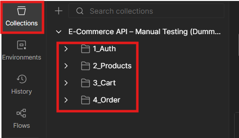
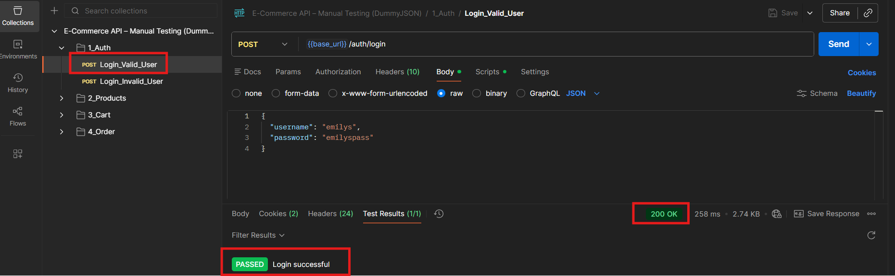
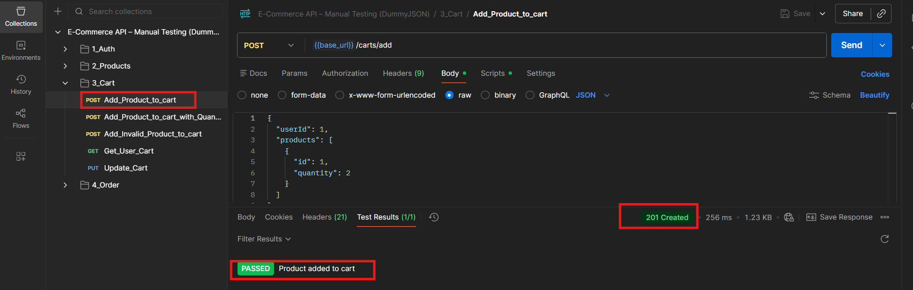
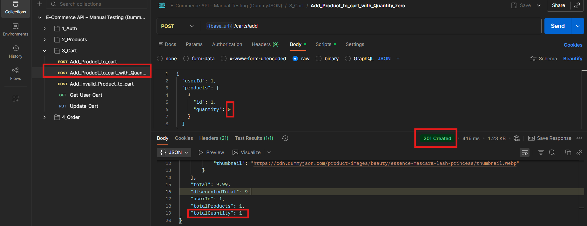
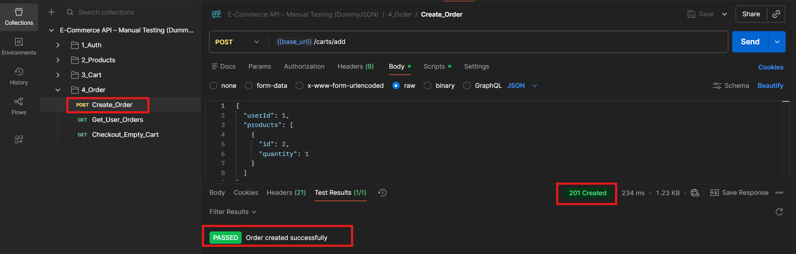

# E-Commerce End-to-End QA Testing 

## Project Overview
This project demonstrates a complete end-to-end Quality Assurance workflow for a sample e-commerce application.
It covers requirements analysis, test scenario design, test case creation, and manual testing across API, UI, and database layers, following industry-aligned SDLC and STLC practices.

The project is structured to be scalable, allowing future expansion into automation and CI/CD pipelines.

---

## Scope of Testing
- Requirements analysis and test design
- Manual API testing (functional, negative, edge cases)
- Manual UI testing (core user workflows)
- Database / SQL validation (data consistency checks)
- Defect-oriented and exploratory testing
- Documentation and execution evidence

---

## Application Under Test
- Backend: Public E-commerce API (DummyJSON)
- Frontend: API-driven demo e-commerce UI
- Database: Logical SQL validation aligned with API responses

## UI Testing Approach

DummyJSON provides backend APIs and does not offer a dedicated production-grade frontend UI.

For this project, UI test cases were designed based on standard e-commerce user workflows and how a typical frontend would consume these APIs.

This approach was used to demonstrate test design skills and user-centric validation in the absence of a full UI implementation.

---

## Testing Artifacts
- Requirements: Functional requirements derived from high level business expectations.
- Test Scenarios: High-level scenarios mapped to requirements
- Test Cases:
  - API testing
  - UI testing
  - SQL / data validation
- Excel Test Cases: Industry-standard execution format
- BDD Samples: Gherkin-based scenarios
- Execution Evidence: Screenshots and API responses

---

## Tools & Technologies
- Postman – API Testing & Collection Runner
- SQL – Backend Data Validation
- GitHub – Version Control & Documentation
- (Future Scope): Selenium, RestAssured, Jenkins

---

## Project Structure

requirements/

test-scenarios/

test-plan/

test-cases/

  api
    
  ui
  
  sql
  
  excel

postman/

screenshots/

bdd-samples/

Findings.md

README.md

--------------

## How to Run API Tests (Postman)

1. Download files from `postman/` folder
2. Import Collection and Environment into Postman
3. Select environment
4. Click Run on the collection
5. Execute all requests

---

## Sample Test Executions

### Postman Collection Overview

### Authentication Success

### Cart Creation

### Edge Case Validation

### Order Creation

---

## Known Observations
Refer to `Findings.md` for documented limitations and system behavior.

---

## Future Enhancements
- API automation using RestAssured
- UI automation using Selenium WebDriver
- CI/CD integration using Jenkins or GitHub Actions
- Advanced database validation

---

## Author

**Pooja Bankar**  
ISTQB Certified QA Engineer  
Manual & Automation Testing | API | SQL | Agile

